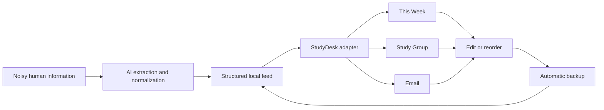
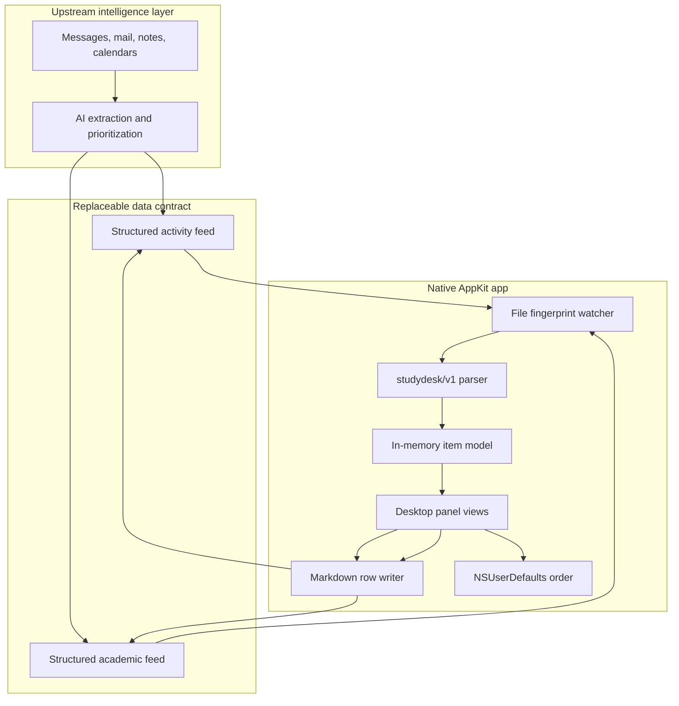

# Vibe Coding Beyond the Demo

## Building StudyDesk, an AI-Organized Information Visualization Layer

StudyDesk is a native macOS visualization layer for information organized by AI. Upstream assistants or automations extract decisions, deadlines, events, and next actions from noisy sources; StudyDesk turns that structured output into a calm, editable desktop surface.

The current reference implementation uses local Markdown as a transparent interchange format. Markdown is an adapter, not the product idea: the same visualization layer could sit on top of JSON, a local database, an email agent, or another structured AI pipeline.

This repository is also a field guide to vibe coding. It documents the prompts, false assumptions, platform failures, data-integrity risks, and acceptance tests that turned a visual prototype into a working application.

> **Start here:** [`docs/VIBE_CODING_TUTORIAL.md`](docs/VIBE_CODING_TUTORIAL.md) reconstructs the project step by step as a reusable tutorial.

## What it does

- Visualizes structured items produced by an AI information-organizing workflow.
- Separates attention into weekly focus, source views, priority, status, context, and next action.
- Combines deadlines remaining in the current week into a **This Week** view.
- Lets you edit an item in a dedicated editor window.
- Sends corrections back through the local structured-data adapter after creating a backup.
- Supports manual card ordering with persistent up/down controls.
- Refreshes when either source file changes.
- Runs as a lightweight menu-bar app with no Dock icon.
- Sits just above the desktop and automatically falls behind normal apps.
- Can launch automatically at login.

## A local-first workflow



The visualization app itself requires no account, API token, analytics service, or network connection. AI organization happens upstream; the boundary between the two systems is explicit and inspectable.

## Quick start

Requirements: macOS 13 or later and the Command Line Tools for Xcode.

```bash
git clone <repository-url>
cd StudyDesk-Vibe-Coding
chmod +x build_app.sh
./build_app.sh
dist/StudyDesk.app/Contents/MacOS/StudyDesk --validate examples
```

Copy the generated `dist/StudyDesk.app` into `/Applications`, then copy the two files from [`examples/`](examples/) to your Desktop:

```text
~/Desktop/StudyDesk-Email.md
~/Desktop/StudyDesk-Study-Group.md
```

The build is ad-hoc signed for local use. It is not notarized. Depending on your macOS security settings, the first launch may require right-clicking the app and choosing **Open**.

## The two phases

### Phase 1 — Make information visible

The first milestone proved the core loop: define a stable contract for AI-organized information and render it as a low-memory desktop panel. The focus was calm presentation, predictable local state, menu-bar controls, and launch-at-login behavior.

### Phase 2 — Make the dashboard actionable

The second milestone added a current-week deadline view, direct editing, automatic backups, and persistent manual ordering. This phase exposed the most useful AI-coding lesson in the project: features that look small often introduce state, lifecycle, and data-integrity problems that are invisible in a static mockup.

Read the practical tutorial in [`docs/VIBE_CODING_TUTORIAL.md`](docs/VIBE_CODING_TUTORIAL.md), the build narrative in [`docs/BUILD_STORY.md`](docs/BUILD_STORY.md), and the candid retrospective in [`docs/AI_CODING_RETROSPECTIVE.md`](docs/AI_CODING_RETROSPECTIVE.md).

## Architecture



The implementation deliberately stays small: one Objective-C/AppKit source file, one property list, and one shell build script. The trade-off is that the code is easier to read and ship, but less modular than a production application.

## Data format

The reference adapter uses `studydesk/v1` front matter and a fixed Markdown table. It demonstrates a broader rule for AI products: put a stable, testable contract between probabilistic extraction and deterministic UI. The schema is documented in [`docs/DATA_FORMAT.md`](docs/DATA_FORMAT.md).

The repository contains fictional sample data only. Do not commit real email summaries, calendars, names, access links, or private course information.

## Repository map

```text
.
├── Native/main.m                 AppKit application and Markdown parser
├── Resources/Info.plist          macOS bundle metadata
├── examples/                     Fictional Markdown inputs
├── docs/VIBE_CODING_TUTORIAL.md  Prompt-by-prompt engineering tutorial
├── docs/BUILD_STORY.md           Phase 1 and Phase 2 narrative
├── docs/WORKFLOW.md              End-to-end development workflow
├── docs/AI_CODING_RETROSPECTIVE.md
├── docs/DATA_FORMAT.md
└── build_app.sh                  Local build and ad-hoc signing
```

## Status and limitations

StudyDesk is a learning project, not a polished product release.

- The filenames are currently fixed.
- The parser expects the exact `studydesk/v1` column order.
- Manual ordering changes the display order, not the Markdown row order.
- Only the first URL in a cell is opened by the card button; all URLs are preserved when editing.
- The app has no sandbox entitlements, automatic updater, or notarized distribution.
- Date parsing currently supports `YYYY-MM-DD` and `YYYY-MM-DD HH:MM` in the Europe/Paris timezone.

## Contributing

Small, focused improvements are welcome. Please avoid adding cloud services, telemetry, or heavy runtime dependencies. See [`CONTRIBUTING.md`](CONTRIBUTING.md).

## License

MIT. See [`LICENSE`](LICENSE).
