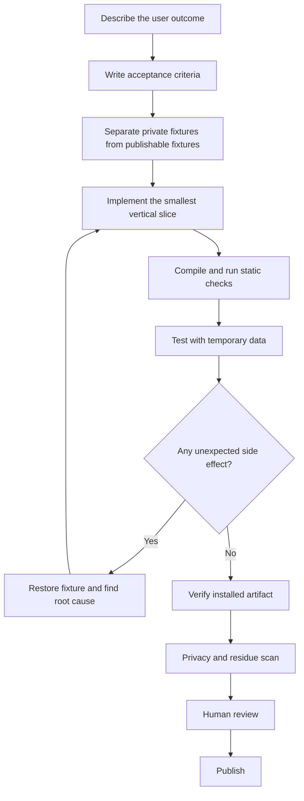

# What this project revealed about AI coding

StudyDesk was built through an extended conversation with an AI coding agent. The product idea was not “render two files”; it was to create a deterministic visualization and correction layer for information already organized by AI. Moving from that idea to a native application was fast, but the process also surfaced characteristic failure modes. These notes are intentionally candid.

## What worked well

### Translating fuzzy product language

Requests such as “a quiet desktop panel,” “warm off-white,” and “fall behind other apps” are not implementation specifications. Conversational iteration helped turn those preferences into concrete AppKit behavior, colors, window levels, and menu actions.

### Crossing disciplines quickly

The project moved through information architecture, Markdown schema design, native UI, file watching, code signing, launch-at-login behavior, and visual polish without a formal handoff between specialties.

### Making the intermediate product inspectable

Because the source of truth remained Markdown, every step could be inspected outside the application. This substantially reduced lock-in and made recovery possible when editing logic misbehaved.

## Where AI coding struggled

### 1. “Done” was inferred too early

A feature could compile and appear correct without surviving real interaction. The first editor rendered correctly, yet conflicted with a refresh timer. Compilation was treated as stronger evidence than it actually was.

**Better practice:** define an acceptance test before implementation. For editing: open the editor, wait longer than the refresh interval, change a field, cancel, verify no file diff, reopen, save, and verify exactly one intended row changed.

### 2. Small features hid state-machine complexity

“Make it editable” introduced focus, modal lifecycle, timers, atomic writes, backups, link preservation, cancellation, and rerendering. AI tends to map a short request to a short patch, even when the feature crosses multiple states.

**Better practice:** write the state transitions first and identify what must be paused, persisted, or rolled back.

### 3. UI automation can create the bug it is testing

Fast synthetic clicks can behave differently from human input. A click that opens a modal can finish over the modal’s default button, causing an unintended save. Automated inspection must be designed so that observing the UI cannot mutate the data under test.

**Better practice:** test against temporary fixtures and use explicit test modes. Never point UI automation at the only copy of meaningful data.

### 4. Duplicate builds create identity problems

Multiple `.app` bundles with the same display name or bundle identifier confuse users, macOS permissions, Launch Services, and automated tooling. An AI agent generating a new bundle for each test can leave a trail of visually identical apps.

**Better practice:** establish one canonical development bundle ID, one QA bundle ID, and one installation path. Clean up only after presenting an exact, recoverable deletion plan.

### 5. Platform behavior is not fully captured by source code

AppKit window levels, activation policies, accessibility trees, LaunchAgent paths, ad-hoc signatures, extended attributes, and Launch Services caches all affect the result. A locally correct binary can still fail to open or appear behind another window.

**Better practice:** maintain a platform-specific release checklist and verify the installed artifact, not only the build directory.

### 6. Data-preservation bugs are easy to miss

The first parser reduced a link cell to its first URL for display. Reusing that parsed value during write-back silently discarded additional links.

**Better practice:** keep raw storage values separate from display values. Round-trip tests should prove that reading and writing an unchanged item produces no diff.

### 7. Requirement drift creates residue

Rapid conversational changes encouraged parallel Swift and Objective-C approaches, visual QA bundles, copied apps, and temporary builds. This is useful during exploration but harmful if the distinction between source, artifact, and test residue is not maintained.

**Better practice:** record an architecture decision when the implementation path changes, then retire obsolete paths deliberately.

### 8. Privacy review must be a release gate

The working version used real filenames and real local data. Publishing the project without a separate sanitization pass could expose personal schedules, organizations, links, paths, or commit metadata.

**Better practice:** publish from a clean export containing generic source discovery, fictional fixtures, a secret scan, and a reviewed diff. Never push the working data directory itself.

## A stronger AI-assisted workflow

## The central lesson

AI coding compresses the distance between intention and implementation. It does not remove the need for engineering discipline; it makes that discipline more important because changes arrive faster than a human can casually audit them.

The most productive role for the human is not to type every line. It is to define invariants: what data may change, what must never be published, what “done” means, and what evidence is required before moving on.
