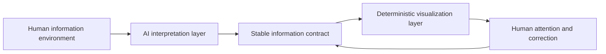
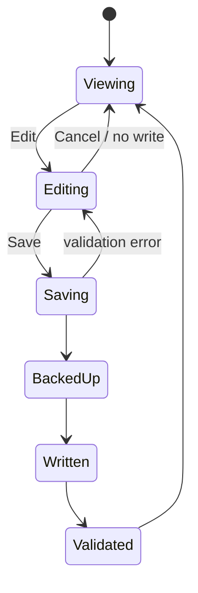

# Vibe coding beyond the demo: lessons from building StudyDesk

This tutorial reconstructs StudyDesk as a conversation between a product owner and an AI coding agent. The prompts are fictionalized and generalized, but the engineering problems are real.

StudyDesk is an AI-organized information visualization layer. An upstream AI workflow turns noisy information into structured items; the macOS app gives those items hierarchy, persistence, weekly focus, and a place for human correction.

The goal of this tutorial is not to teach a magic prompt. It is to teach a control loop for building software with AI without surrendering product judgment, data safety, or evidence.

## The model: three systems, not one app

The first conceptual mistake would be to describe StudyDesk as “an app that reads Markdown.” That describes a transport mechanism, not the product.



There are three different systems:

1. **Interpretation.** AI decides what matters, extracts dates, assigns rough priority, and proposes a next action.
2. **Contract.** A structured representation separates uncertain interpretation from deterministic software.
3. **Interaction.** StudyDesk visualizes, filters, orders, and edits the structured information.

In the reference build, the contract is `studydesk/v1` Markdown. It could later be JSON, SQLite, or an API without changing the product thesis.

This separation is the first general lesson: probabilistic AI output should cross an explicit boundary before it drives a deterministic interface.

## Before prompting: write invariants

Vibe coding often begins with a mood: “make this calm, minimal, and useful.” Mood is valuable for product direction, but it does not tell an agent what must never break.

Before the first implementation prompt, write a short invariant sheet:

| Area | Invariant |
|---|---|
| Attention | The dashboard must remain visible on the desktop but never cover normal work. |
| Privacy | The visualization layer must not require email credentials or network access. |
| Portability | The structured information must remain usable without the app. |
| Performance | Do not ship a browser runtime for a small native panel. |
| Safety | Canceling an edit must produce no data change. |
| Identity | There is one canonical installed app and one canonical bundle ID. |
| Evidence | “Done” means an observed behavior, not a successful compile. |

An invariant is more useful than a feature list because it survives implementation changes.

---

# Phase 1 — Turn an information concept into a reliable surface

## Step 1: prompt for the outcome, not the framework

### Example prompt

> I have an AI workflow that organizes important information from several sources. Build a small macOS surface that keeps the results visible on the desktop. It should feel like a quiet paper object, use little memory, disappear behind normal applications, and remain controllable from the menu bar. First restate the behavior and unresolved decisions. Do not choose a framework yet.

### What this prompt does well

It specifies the user’s relationship with the software before naming technologies. It also asks the agent to expose uncertainty instead of silently converting every vague phrase into code.

### What we discovered

“Always visible” was ambiguous. It could mean:

- always on top;
- a normal window kept open;
- a desktop widget;
- a window above the wallpaper but below applications.

Only the fourth interpretation matched the desired attention model.

### Deeper lesson

Natural-language requirements often contain hidden dimensions. Ask the agent to enumerate interpretations when one phrase could map to multiple platform primitives.

### Acceptance gate

- StudyDesk is visible when looking at the desktop.
- Opening another application covers it.
- The menu-bar item can show and hide it.

## Step 2: make the AI boundary explicit

### Weak prompt

> Read my messages and show the important things.

This collapses extraction, credentials, source access, ranking, storage, and UI into one opaque feature.

### Better prompt

> Treat AI information extraction as an upstream system. Define a stable local contract for the visualization layer. Each item needs a stable ID, source context, type, priority, start time, deadline, status, details, next action, links, and last-updated time. The app should be deterministic once it receives this structure.

### What we discovered

Once the contract existed, the UI became simpler and safer. The app no longer needed to understand email prose or chat history. It only needed to validate and visualize normalized items.

### Deeper lesson

Do not let an LLM response become an informal database schema. Put a versioned contract between AI interpretation and application behavior.

### Acceptance gate

- Invalid schemas produce a readable error.
- Stable IDs survive title changes.
- An unchanged item can be parsed and written back without losing information.

## Step 3: constrain the implementation with product economics

### Example prompt

> Compare native AppKit, SwiftUI, and Electron for this specific product. Optimize for low idle memory, desktop-level window behavior, a menu-bar control, and a tiny distribution. Recommend one approach and explain the trade-off before implementing.

### What we discovered

The choice was not “modern versus old.” The decisive requirements were window-level control and runtime size. AppKit was a direct fit. A heavier architecture could have produced the same pixels while violating the product’s quietness.

### Deeper lesson

Framework choice is part of product design. Ask the AI to reason from operating constraints, not ecosystem popularity.

### Acceptance gate

- One native executable.
- No bundled browser engine.
- No Dock icon.
- Desktop-layer and menu-bar behaviors work on a real Mac.

## Step 4: ask for one vertical slice

### Example prompt

> Implement one end-to-end slice: parse one fictional structured item, render one card, detect a fixture change, and refresh once. Do not add launch-at-login, editing, sorting, or visual polish yet. Include a command-line validation mode for fixtures.

### What we discovered

This is where a disciplined workflow diverges from “build the whole app.” A thin vertical slice tests the hardest interface boundaries early: parsing, state, rendering, and refresh.

### Deeper lesson

AI can generate a wide surface area quickly, which makes horizontal implementation tempting. Vertical slices produce better evidence and cheaper reversals.

### Acceptance gate

- A fictional fixture validates from the command line.
- One edit to the fixture creates one visible refresh.
- A malformed fixture fails without crashing.

## Step 5: translate visual taste into a system

### First prompt

> Make it look minimal and elegant.

This produced something technically clean but visually generic.

### Revised prompt

> Use a warm off-white canvas, restrained borders, a single terracotta action color, serif display titles, compact monospaced metadata, and generous vertical rhythm. Avoid gradients, glass effects, dashboard charts, and excessive pills. Define reusable color and spacing tokens before restyling components.

### What we discovered

The phrase “minimal” is underdetermined. A reference mood becomes actionable only when translated into contrast, typography, spacing, density, and exclusions.

### Deeper lesson

When giving visual direction to AI, specify both positive rules and forbidden defaults. Otherwise the model often converges on familiar design-system clichés.

### Acceptance gate

- One clear typographic hierarchy.
- One accent color for actions and urgency.
- Metadata is quieter than task titles.
- The interface still reads at the smallest supported window size.

## Step 6: test the installed artifact, not just the source

### Example prompt

> Build and install one canonical app bundle. Before testing, inventory all bundles with the same name or identifier. Verify the installed executable, bundle ID, signature, launch-at-login target, and running process. Do not create additional QA copies unless they use a distinct name and bundle ID.

### What we discovered

Repeated AI iterations created visually identical apps. macOS permissions, Launch Services, and the user could no longer agree on which copy was “StudyDesk.” A correct binary inside the wrong bundle was still a broken product.

### Deeper lesson

Artifact identity is application state. In desktop development, paths, signatures, bundle IDs, and running processes are part of correctness.

### Acceptance gate

- Spotlight and Finder show one production app.
- The running binary matches the installed binary.
- Login startup opens the canonical path.
- Permission prompts identify the expected bundle.

---

# Phase 2 — Turn a visualization into an interaction system

## Step 7: define time before building “This Week”

### Weak prompt

> Add a column for this week.

### Better prompt

> Add a This Week view across all structured feeds. Include deadlines from the start of today through Sunday at 23:59 in the configured timezone. Exclude deadlines already passed earlier this week. Sort by deadline unless the user has established a manual display order. Explain the boundary cases before coding.

### What we discovered

“This week” contains product policy:

- Does the week begin Monday or Sunday?
- Do date-only deadlines expire at midnight or the end of the date?
- Are optional items included?
- Are completed items shown?
- What happens across timezones?

### Deeper lesson

Filters are often compressed business rules. Make the rule legible before asking for code.

### Acceptance gate

- Test Monday, Sunday, and a timezone boundary.
- Test date-only and date-time values.
- Test a deadline earlier today and one exactly at next Monday.

## Step 8: distinguish storage order from attention order

### Example prompt

> Let the user move cards up and down, but do not reorder the underlying AI-generated feed. Persist a separate presentation order keyed by stable item ID. Define behavior for new, removed, and duplicated IDs.

### What we discovered

Sorting is not always a data mutation. The AI’s source order, chronological order, and the user’s attention order are different concepts.

### Deeper lesson

Separate semantic data from presentation preferences. Doing so reduces noisy diffs and avoids sending UI-only decisions back into the information pipeline.

### Acceptance gate

- Reordering survives relaunch.
- New items still appear.
- Removed IDs do not crash sorting.
- The structured source remains byte-for-byte unchanged.

## Step 9: treat editing as a transaction

### First prompt

> Add an Edit button and save the values back.

The feature looked small, so the first implementation used a modal form and rewrote a row. That exposed several risks:

- the background refresh timer continued while editing;
- the card that opened the editor could be rerendered;
- automated mouse-up events could land on the default Save button;
- a display-only first URL replaced a cell that originally contained multiple links;
- tests touched meaningful source data.

### Revised prompt

> Model editing as an explicit transaction. Open a dedicated non-modal editor. Pause refresh while it is open. Preserve raw values that are not shown. On Save: create a timestamped backup, locate the item by stable ID, replace only that row, write atomically, reparse, and verify the result. On Cancel: produce no file diff. Test only with disposable fixtures.

### What we discovered

The correct fix was not a longer delay. It was a better state model.



### Deeper lesson

When an AI proposes a timing patch for a lifecycle bug, step back. Race conditions usually require ownership and state transitions, not another delay.

### Acceptance gate

- Keep the editor open for longer than the refresh interval.
- Cancel and verify zero diff.
- Save and verify exactly one intended row plus metadata changed.
- Edit a row containing multiple links and verify every link survives.
- Simulate a write failure and verify the original remains readable.

## Step 10: make testing observationally safe

### Example prompt

> Create a QA plan in which inspection cannot mutate production-like data. Use fictional fixtures in a temporary directory. Separate UI-open tests, Cancel tests, Save tests, and installed-artifact tests. Restore from a verified backup after any unexpected write.

### What we discovered

UI automation is an actor, not a passive camera. Clicking, focusing, committing a text field, or dismissing a modal can change state. “I only tested it” is not a safety argument.

### Deeper lesson

Every test has a blast radius. AI agents should name that radius before running the test.

### Acceptance gate

- Tests use synthetic data.
- Pre-test and post-test hashes are recorded.
- Unexpected differences stop the workflow.
- Recovery is demonstrated, not assumed.

---

# How to debug with an AI agent

## Use a symptom-to-invariant prompt

Instead of:

> It still does not work. Fix it.

Use:

> Symptom: the editor disappears before I can type. Invariant: opening an editor must suspend background UI replacement, and Cancel must never write. Reproduce the failure, identify every event that can close or rerender the editor, show the state transition that violates the invariant, then propose the smallest architectural fix. Do not modify real data during diagnosis.

This prompt supplies four things an AI debugger needs:

1. an observable symptom;
2. a non-negotiable invariant;
3. a bounded investigation;
4. a safety constraint.

## Ask for competing hypotheses

```text
List at least three plausible causes, the evidence for each, and one read-only
check that would distinguish them. Do not implement a fix until one hypothesis
is supported.
```

This reduces the tendency to patch the first plausible line of code.

## Ask for proof proportional to risk

```text
Before calling this complete, show:
- build result;
- fixture validation result;
- exact file diff for Save;
- zero diff for Cancel;
- installed bundle version and identity;
- privacy scan for the publishable export.
```

“Works on my generated build” is not enough when the feature writes user data.

---

# A reusable prompt ladder

The following sequence is a stronger alternative to one giant “build my app” prompt.

## Prompt 1 — Product interpretation

```text
Restate the desired user experience as observable behavior. Identify ambiguous
phrases, platform constraints, privacy boundaries, and irreversible actions.
Do not code yet.
```

## Prompt 2 — System boundaries

```text
Separate probabilistic AI interpretation, the stable data contract, and the
deterministic interface. Define ownership and failure behavior at each boundary.
```

## Prompt 3 — Vertical slice

```text
Implement the smallest end-to-end slice with fictional fixtures. Include a
validation command and stop after the slice is demonstrated.
```

## Prompt 4 — Experience pass

```text
Translate these visual and behavioral references into explicit tokens,
hierarchy, window behavior, and exclusions. Show the design before expanding
scope.
```

## Prompt 5 — State-changing feature

```text
Before implementing editing, list state transitions, concurrency sources,
backup behavior, cancellation behavior, and acceptance tests. Treat Save as a
transaction and Cancel as a zero-diff invariant.
```

## Prompt 6 — Installed-artifact verification

```text
Verify the canonical installed artifact: path, executable hash, bundle ID,
version, signature, running process, permissions, and login target. Inventory
duplicates but do not delete anything without an exact confirmation list.
```

## Prompt 7 — Publication gate

```text
Create a clean public export. Replace real data with fictional fixtures,
generalize identifiers and paths, exclude backups and builds, scan for personal
information and secrets, show me the final diff, and wait for approval before
publishing.
```

---

# The operator’s checklist

## Before the AI writes code

- Can I describe the outcome without naming a framework?
- What must never happen?
- Which data is real, private, or irreplaceable?
- What is the smallest vertical slice?
- What evidence will count as done?

## Before the AI changes state

- Is the target exact?
- Is the action reversible?
- Is there a verified fixture or backup?
- Could a UI test itself trigger the side effect?
- Does the current authorization cover this action?

## Before publishing

- Is this a clean export rather than the working directory?
- Are fixtures synthetic?
- Are absolute paths and bundle identifiers generic?
- Is generated output ignored?
- Does commit metadata use a public identity?
- Has a human reviewed the rendered README and diagrams?

# Final takeaway

The promise of vibe coding is not that intent automatically becomes correct software. Its real advantage is a tighter loop between product thought, implementation, observation, and revision.

The danger is that generation speed can outrun verification. The remedy is not less conversation; it is better conversation—prompts that express invariants, expose ambiguity, bound side effects, demand evidence, and preserve a human decision point before irreversible actions.

StudyDesk is small enough to make those lessons visible. That is why it is useful as a tutorial: the bugs were not caused by difficult algorithms. They came from the same things that break larger systems—unclear boundaries, hidden state, artifact identity, lifecycle races, data loss, and premature claims of completion.

---

# Appendix — Build the complete product

The repository includes the complete, runnable reference implementation used by this case study. It is a privacy-clean public export, not a copy of any private working directory.

## Product source

| File | Purpose |
|---|---|
| [`Native/main.m`](../Native/main.m) | Complete AppKit application, structured-data parser, weekly filtering, editor, ordering, backups, menu-bar controls, desktop-level behavior, and login startup |
| [`Resources/Info.plist`](../Resources/Info.plist) | Generic macOS bundle metadata |
| [`build_app.sh`](../build_app.sh) | Reproducible compilation, app-bundle assembly, and ad-hoc signing |
| [`examples/StudyDesk-Email.md`](../examples/StudyDesk-Email.md) | Fictional structured feed for validation |
| [`examples/StudyDesk-Study-Group.md`](../examples/StudyDesk-Study-Group.md) | Second fictional structured feed for validation |

No proprietary framework or hidden source file is required. The implementation uses Cocoa and Core Graphics from macOS.

## Build and validate

```bash
chmod +x build_app.sh
./build_app.sh
dist/StudyDesk.app/Contents/MacOS/StudyDesk --validate examples
```

A successful fixture validation reports two items from the activity example and three items from the email example.

## Run with the fictional data

Copy the example feeds to the Desktop using the filenames expected by the reference adapter:

```bash
cp examples/StudyDesk-Email.md ~/Desktop/StudyDesk-Email.md
cp examples/StudyDesk-Study-Group.md ~/Desktop/StudyDesk-Study-Group.md
open dist/StudyDesk.app
```

These examples contain invented organizations, tasks, dates, and `example.com` links. Replace them with your own structured AI output locally, but keep real data outside the repository.

## Privacy boundary of the public code

The public source intentionally contains:

- a generic bundle identifier;
- generic adapter filenames;
- fictional structured fixtures;
- no credentials or network integrations;
- no absolute home-directory paths;
- no private backups or generated app bundle.

This separation is part of the tutorial itself: publish a reviewed export, never the working directory that contains the user’s real information environment.
