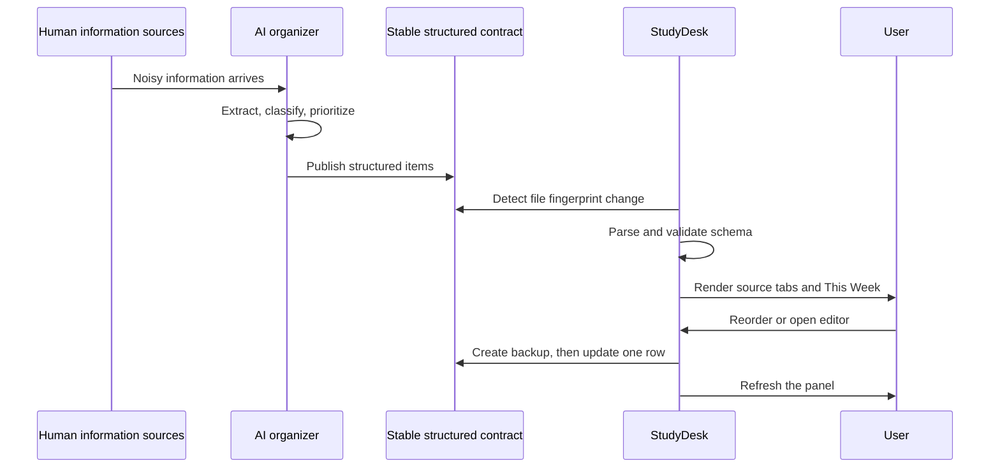

# End-to-end workflow

This is the complete workflow used to turn AI-organized information into a native macOS attention surface. The reference implementation uses Markdown as its local contract, but the product workflow is format-independent.

## Product workflow

## Development workflow

### Discover

1. Describe the desired behavior in user terms.
2. Identify platform constraints and privacy boundaries.
3. Decide what belongs to AI interpretation, the interchange contract, and deterministic app state.

### Contract

1. Define a versioned information contract; `studydesk/v1` is the reference adapter.
2. Create fictional fixtures before writing UI code.
3. Specify date formats, stable IDs, status values, and priority values.

### Build Phase 1

1. Parse fictional structured feeds.
2. Render cards in a native panel.
3. Watch modification fingerprints.
4. Add menu-bar and login controls.
5. Tune window behavior and visual hierarchy.

### Verify Phase 1

1. Validate both sample files.
2. Change one fixture and confirm one refresh.
3. Open another app and confirm StudyDesk moves behind it.
4. Quit and relaunch from the menu bar and login configuration.

### Build Phase 2

1. Merge sources for the weekly deadline view.
2. Add persistent display ordering.
3. Add a dedicated editor panel.
4. Pause refresh while editing.
5. Back up and atomically replace only the matching Markdown row.

### Verify Phase 2

1. Leave the editor open beyond the refresh interval.
2. Cancel and confirm a zero-byte diff.
3. Save a fixture change and confirm only the intended row and timestamp changed.
4. Confirm multiple URLs survive an unrelated edit.
5. Confirm the weekly boundary in the configured timezone.

### Release

1. Build a clean `.app` outside the source directory.
2. Ad-hoc sign the local build.
3. Install one canonical app bundle.
4. Verify the installed binary and bundle metadata.
5. Scan the public export for private paths, addresses, names, and real data.
6. Obtain human approval before publishing.

## Artifacts by responsibility

| Artifact | Responsibility | Published? |
|---|---|---:|
| `Native/main.m` | Application behavior | Yes |
| `Resources/Info.plist` | Bundle metadata | Yes |
| `build_app.sh` | Reproducible local build | Yes |
| `examples/*.md` | Fictional schema fixtures | Yes |
| Real summaries | Personal source data | Never |
| Application Support backups | Recovery | Never |
| Temporary `.app` builds | QA residue | Never |
| LaunchAgent | Local installation state | Never |
